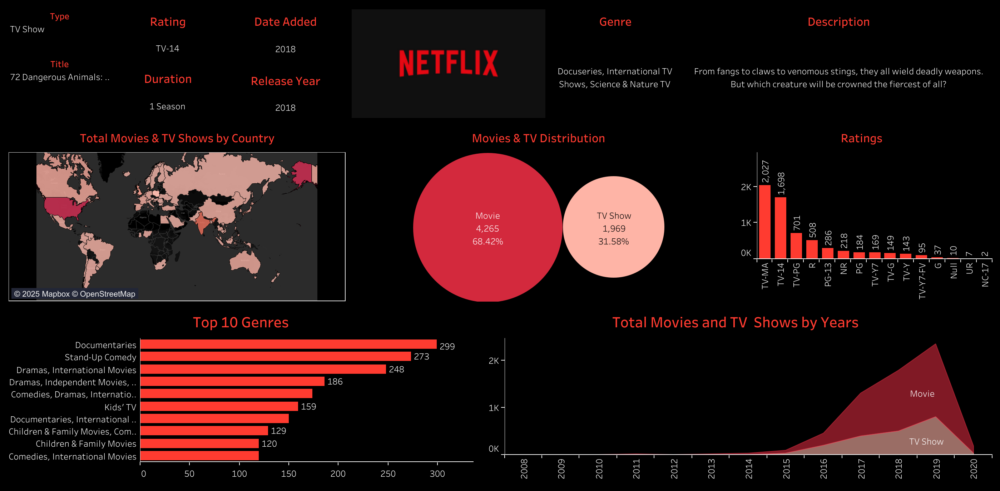

# 📊 Netflix Content Insights Dashboard

This repository contains a comprehensive data visualization dashboard that analyzes Netflix's global content library. The visualizations were created to uncover trends related to genres, countries, ratings, and content distribution over time.

## 🧾 Overview

This dashboard provides key insights into:
- **Content Type Breakdown**: Proportion of Movies vs. TV Shows.
- **Top Genres**: Most represented genres in Netflix’s library.
- **Content Rating Distribution**: Classification by TV and movie ratings (TV-MA, TV-14, R, PG-13, etc.).
- **Geographical Distribution**: A global heatmap showing the number of Netflix titles available per country.
- **Temporal Trends**: Content release trends from 2008 to 2020.
- **Content Metadata Example**: Displayed metadata for the show *"72 Dangerous Animals: Asia"*.

## 📁 Files Included

- `Netflix.png`: Final dashboard visualization.
- `data/netflix_titles.csv`: Source dataset (optional, if used).
- `scripts/`: Folder for any transformation or EDA scripts (optional).

## 📈 Visualizations Explained

### ✅ Content Distribution  
- **Movies** make up **68.42%** of the dataset.  
- **TV Shows** account for **31.58%**.

### 🌍 Titles by Country  
- A choropleth map visualizes the total number of titles per country.  
- Darker shades indicate higher title counts (e.g., USA, India, UK).

### 🎬 Top 10 Genres  
- Most common genres include:
  - Documentaries
  - Stand-Up Comedy
  - Dramas (International/Independent)
  - Children & Family Movies
  - Comedies

### 🔞 Ratings Breakdown  
- Most titles are rated **TV-MA** and **TV-14**.
- Useful for filtering content based on target audience.

### 📅 Titles Over Time  
- Major spike in content releases after 2014.  
- Peak observed around **2019** for both Movies and TV Shows.

## 🧰 Tools Used

- **Tableau** for dashboard creation and visualization
- **Excel**: For initial data processing
- **Mapbox**: For rendering the geographical map

## 📚 Dataset Source

Netflix Titles dataset (publicly available):  
[https://www.kaggle.com/shivamb/netflix-shows](https://www.kaggle.com/shivamb/netflix-shows)

## 🚀 How to Use

1. Clone this repository.
2. Open the Tableau workbook (if included) or refer to `Netflix.png` for dashboard insights.
3. Optionally run preprocessing scripts located in the `/scripts` directory.

## 📌 Use Cases

- Business intelligence analysis for streaming platforms
- Market research on global content preferences
- Academic or portfolio project for data storytelling

---
